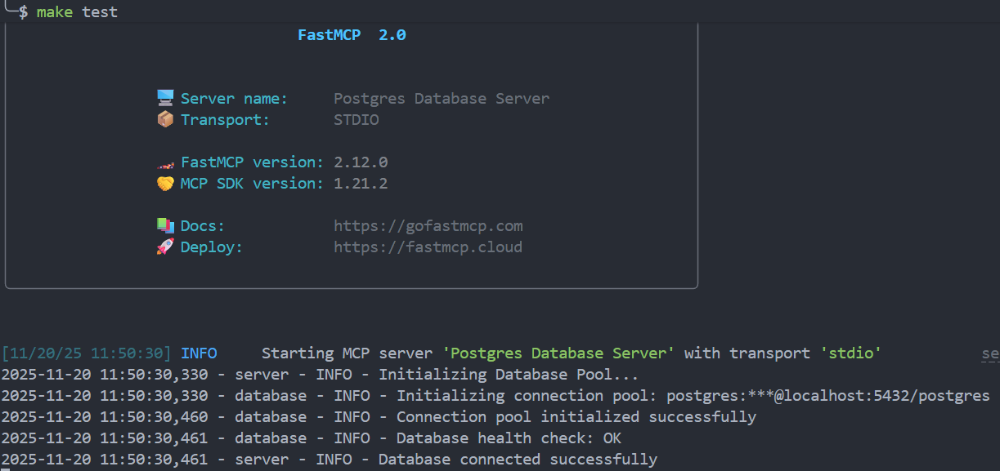
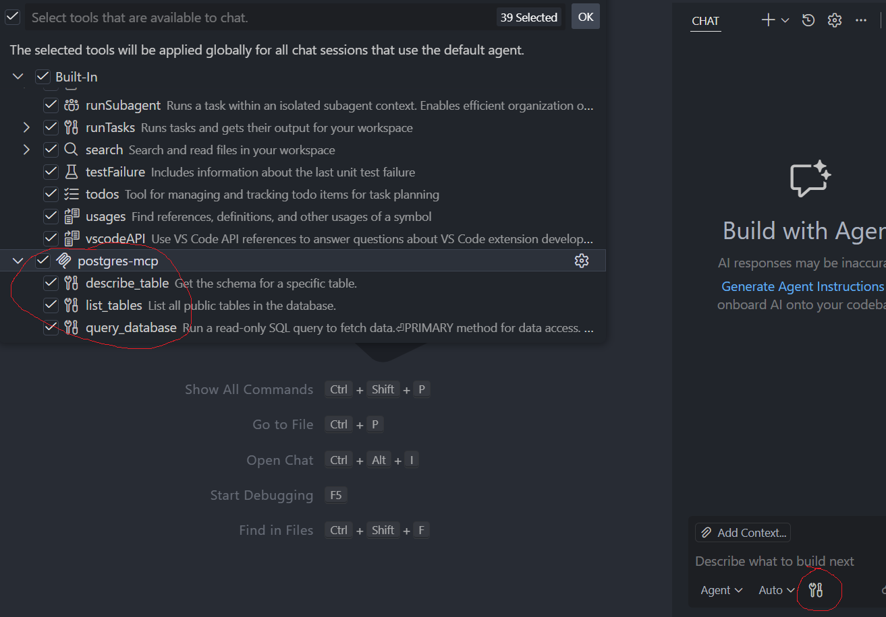
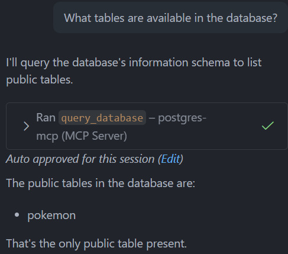
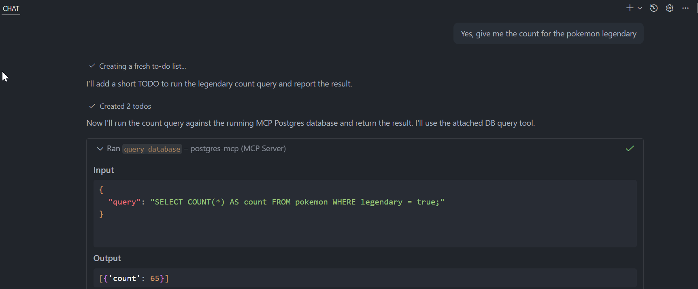

# Postgres MCP Server

A Model Context Protocol (MCP) server that enables AI assistants to interact with PostgreSQL databases through natural language queries.

## 📁 Project Structure

```
mcp-postgres/
├── src/
│   ├── __init__.py
│   ├── main.py          # Entry point
│   ├── server.py        # MCP server implementation
│   ├── database.py      # Connection pool management
│   ├── config.py        # Configuration handling
│   ├── models.py        # Data models and enums
│   └── utils/
│       └── logging.py   # Logging setup
├── .env                 # Local environment variables (not in git)
├── .vscode/
│   └── mcp.json        # VS Code MCP client config (not in git)
├── docker-compose.yml  # PostgreSQL for testing
├── Makefile            # Development commands
└── pyproject.toml      # Python dependencies
```

## Prerequisites

- Python 3.10 or higher
- [uv](https://github.com/astral-sh/uv)
- Docker and Docker Compose (for local testing)

## Installation

### 1. Clone the repository

```bash
git clone <your-repo-url>
cd mcp-postgres
```

### 2. Install dependencies

Using uv:
```bash
make install
```

Or manually:
```bash
uv sync
```

### 3. Configure environment variables

Create a `.env` file in the project root:

```env
DB_HOST=localhost
DB_PORT=5432
DB_NAME=postgres
DB_USER=postgres
DB_PASSWORD=postgres
```

## Local Testing

Start the PostgreSQL database and run the server:

```bash
make test
```



This will:
1. Start a PostgreSQL container via Docker Compose
2. Launch the MCP server
3. Connect to the database on `localhost:5432`

To stop and clean up:
```bash
make clean
```

## MCP Client Integration

### For VS Code Extensions 

Create or update `.vscode/mcp.json` in your project:

```json
{
  "servers": {
    "postgres-mcp": {
      "command": "/absolute/path/to/.venv/bin/python",
      "args": [
        "/absolute/path/to/src/main.py"
      ],
      "env": {
        "DB_HOST": "localhost",
        "DB_PORT": "5432",
        "DB_NAME": "postgres",
        "DB_USER": "postgres",
        "DB_PASSWORD": "postgres"
      }
    }
  }
}
```

**Important**: Replace `/absolute/path/to/` with your actual project path. You can get it by running:
```bash
pwd
```

### Configuration Priority

- When running `make test`: Uses `.env` file
- When running via MCP clients: Uses `env` section from `mcp.json` (overrides `.env`)

### Tools checks

For checking if tools are detected. Press the "Configure tools" icon and check that they are all present in our mcp server.


## Examples

Once connected, the MCP server exposes these tools to AI assistants.

**Example prompt**: "What tables are available in the database?"


**Example prompt**: "Give me the count for the pokemon legendary"



